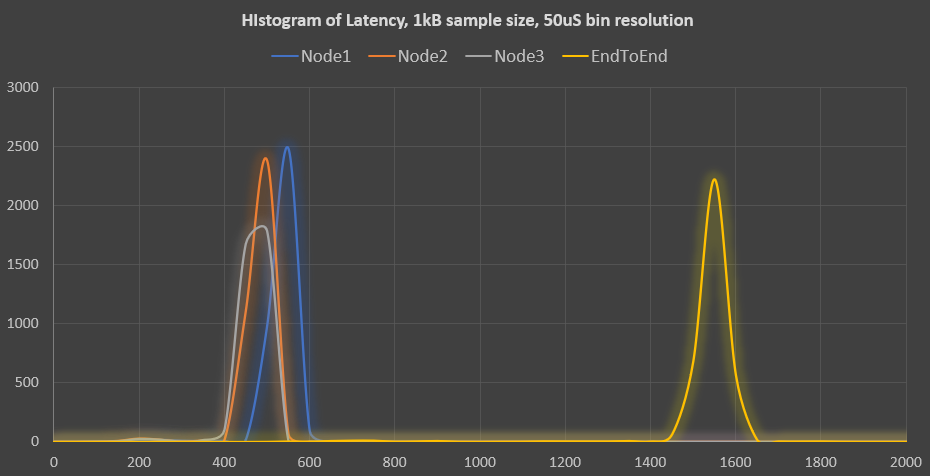

# ros2_mp_latency
IPC latency test for ROS2, multi-process.

This is a configurable ROS2 system latency test, built using small ROS2 components.  

This test will build 3 component types:
 * ipchead: Publishes the build-selected data type to a named topic, at a given rate & reliability.  The sample is timestamped before publication.
 * ipcnode: Receives a sample from a named topic, adds timestamps to sample then re-publishes on a named topic.
 * ipctail: Receives a sample from a named topic, timestamps then computes latency at each step, writes results to:
 ** A sequential log file for that test run.
 ** A histogram file for that test run.
 ** Adds a statistical summary for that test run to a common file.

 Given the above components, many different test configurations can be devised and automated using ROS2 Launch files and shell scripts or batch files, such as:

  * HEAD-->NODE1-->NODE2->->->NODE(N)-->TAIL
  * HEAD-=>(N NODES in parallel)==>(N TAILS)
  * HEAD-=>(N NODES in parallel)=-->TAIL(common)
  
  Components may be on the same machine or distributed throughout your system.

# To Build:
Build as you would any ROS2 component:
```bash
  mkdir ros2_ws; cd ros2_ws
  git clone (this repository)
  source (your ROS2 installation)/setup.bash
  colcon build --symlink-install
```
Note that the data type used in the test is a build-time option, selected in the file `mp_latency/include/IpcTestDefs.hpp`.  
Edit this value and rebuild to test with a different size data sample (100 bytes to 500kB).

# To Run:
Runs as normal ROS2 components, with command-line arguments (and default values) for each:
 * `ipchead`: 5 args:
 ** `testDuration` in seconds, to run the test then exit (default: 60)
 ** `relType` reliability, "REL" or "BE" (best effort)
 ** `pubFreq` publish frequency, in Hz (1)
 ** `myNodeId` ID number for this HEAD node (0)
 ** `toTopic` Named topic to publish ("fromHead")

 * `ipcnode`: 5 args:
 ** `testDuration` in seconds, to run the test then exit (default: 60)
 ** `relType` reliability, "REL" or "BE" (best effort)
 ** `myNodeId` ID number for this node (1)
 ** `fromTopic` Named topic to subscribe ("fromHead")
 ** `toTopic` Named topic to publish ("toTail")

 * `ipctail`: 7 args:
 ** `testDuration` in seconds, to run the test then exit (default: 60)
 ** `relType` reliability, "REL" or "BE" (best effort)
 ** `pubFreq` publish frequency, in Hz (1)
 ** `nodesInChain` number of nodes leading to this chain (3)
 ** `fromTopic` Named topic to subscribe ("toTail")
 ** `rmwType` RMW in use during this test ("unknown")
 ** `myConfig` Named configuration for this test ("defaultCfg")

If each component is launched on a ROS2 command line with no arguments, such as:  
```bash
  ros2 run mp_latency ipchead &
  ros2 run mp_latency ipcnode &
  ros2 run mp_latency ipctail &
```
it will run a 60-second latency test and write the results to files.
For convenience and to run custom tests, ROS2 Launch file examples and shell scripts are included to help with test automation.  The launch files can be run as normal ROS2 launch files, such as:  
```bash
  ros2 launch mp_latency/launch/mplat_ser5.py
```
This will launch a test configuration of: HEAD-->(5 nodes in series)-->TAIL.

# Output Data Files
3 File types are produced, all are in .csv (comma-separated values) format for easy opening with a spreadsheet program.  
This enables easy sorting and grouping of results, and visualization of latency distribution histograms, such as:  



