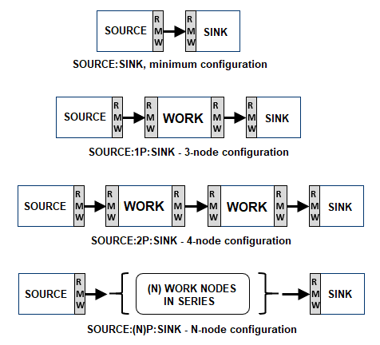
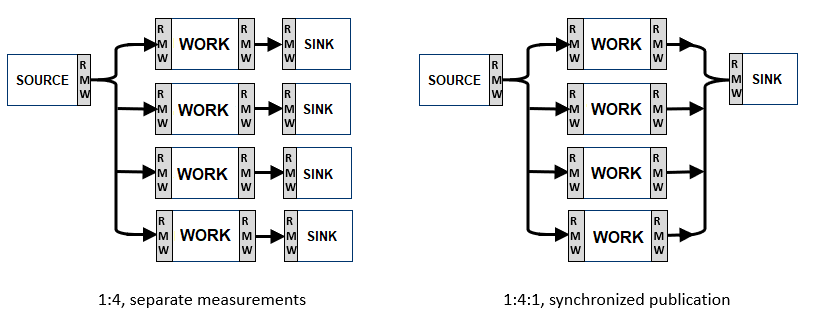

# ros2_mp_latency
IPC latency test for ROS2, multi-process.

This is a configurable ROS2 system latency test, built using small ROS2 components.  

This test will build 3 component types:
 - **ipcsource**: Publishes the build-selected data type to a named topic, at a given rate & reliability.  The sample is timestamped before publication.
 - **ipcprocess**: Receives a sample from a named topic, adds timestamps to the sample then re-publishes on a named topic.
 - **ipcsink**: Receives a sample from a named topic, timestamps then computes latency at each step, writes results to:
    - A sequential log file for that test run.
    - A histogram file for that test run.
    - Adds a statistical summary for that test run to a common file.  
    These files are placed in the directory from which ipcsink is launched.  

Given the above components, many different test configurations can be devised and automated using ROS2 Launch files and shell scripts or batch files; 1-to-1, 1-to-many, etc.:

  
msg passing latency is measured end-to-end and at every step.  

  
Fan-out and Fan-in conditions may also be measured for latency.  
  
Components may be on the same machine or distributed throughout your system, and can be tested with any available ROS2 RMW implementation.  

# To Build:
Build as you would any ROS2 component:
```bash
  mkdir ros2_ws; cd ros2_ws
  git clone (this repository)
  source (your ROS2 installation)/setup.bash
  colcon build --symlink-install
```
Note that the data type(and size) used in the test is a build-time option.  
Separate executable images for each size are created; this is selected in the file `mp_latency/include/IpcTestDefs.hpp` by a compiler definition (MP_DATA_SIZE), which is passed by the CMakeLists.txt build
to create a series of executables (3 types of executable for each data type in the test).  

# To Run:
Runs as normal ROS2 components, with command-line arguments and use of environment variables.  
This test runs in separate processes; each has command-line arguments and uses a set of 
environment variables to configure the test.  Therefore it is recommended to use ROS2 launch
files and a shell script to automate the setting of these values.  
(example launch and script files are included).  


## Running a test suite using a shell script:
To run a quick test sweep of: 5 data types (100 to 500k bytes), 3 RMW types, 
reliable/best effort, 1 pub freq, 1 config, run the following script:
```bash
  scripts/run_quick_a.sh
```
This shell script repeatedly calls the ROS2 launch file in mp_latency/launch/mplat_ser_n.py
with variations in the environment variables that control the test, resulting in a 
complete comparison test in a very short period of time.  


## Running a single test using a ROS2 launch file:
A single test configuration can be run using a ROS2 launch file to launch the desired
test configuration: quantity and type of each test process.   Example launch files are
provided that use environment variables to set the command line options, or these may be
set directly in the launch file.  
For example, a test that runs a SOURCE-->PROCESS-->SINK test configuration using the 100 byte 
data size may be launch with the example launch file as:  
```bash
  ros2 launch mp_latency/launch/mplat_ser_n.py
```
If the expected environment variables are not set, the test will use the default values 
defined in the launch file.


## Running the individual executables manually from a command line:
The command line arguments (and default values) for each application are:  

**ipcsource**: 5 args:
 - `testDuration` in seconds, to run the test then exit (default: 60)
 - `relType` reliability, "REL" or "BE" (best effort)
 - `pubFreq` publish frequency, in Hz (1)
 - `myNodeId` ID number for this SOURCE node (0)
 - `toTopic` Named topic to publish ("fromSource")

**ipcprocess**: 5 args:
 - `testDuration` in seconds, to run the test then exit (default: 60)
 - `relType` reliability, "REL" or "BE" (best effort)
 - `myNodeId` ID number for this node (1)
 - `fromTopic` Named topic to subscribe ("fromSource")
 - `toTopic` Named topic to publish ("toSink")

 **ipcsink**: 7 args:
 - `testDuration` in seconds, to run the test then exit (default: 60)
 - `relType` reliability, "REL" or "BE" (best effort)
 - `pubFreq` publish frequency, in Hz (1)
 - `nodesInChain` number of nodes leading to this chain (3)
 - `fromTopic` Named topic to subscribe ("toSink")
 - `rmwType` RMW in use during this test ("unknown")
 - `myConfig` Named configuration for this test ("defaultCfg")

The RMW selection is made by ROS2 using the environment variable RMW_IMPLEMENTATION.  

This test places its resulting data files into the directory where ipcsink_* was launched, so it's
recommended to create a results directory and launch the test from there.  

If each component is launched on a ROS2 command line with no arguments, such as:  
```bash
  ros2 run mp_latency ipcsource_1kb &
  ros2 run mp_latency ipcprocess_1kb &
  ros2 run mp_latency ipcsink_1kb &
```
it will run a SOURCE-->PROCESS-->SINK latency test using default values, and write the results to files.  

# Output Data Files
3 File types are produced, all are in .csv (comma-separated values) format for easy opening with a spreadsheet program.  

## test_(options)_log.csv
This file is a sequential log with the results of each test sample, written as it is received.  

## test_(options)_histo.csv  
This file contains a binned histogram summary of the test run, written at test completion.  
The resolution (width) of the bins are set at compile time by variables in IpcSink.cpp.  
Default values are: 1uS collection bin width, 10uS print bin width.  
The histogram view offers easy visualization of the latency distribution of your system, such as:    


## statsAll.csv  
This file contains a statistical summary of the latency of each test run.  
The file is appended at each test completion with test conditions and statistics (min/mean/max/std.dev/count)
derived from the data in the histogram collection bins.  
The data includes the individual latencies of each pub:sub pair in the test, and a sum of all latencies
for an end-to-end total.  
Test conditions are placed in separate columns to enable sorting and filtering in a spreadsheet, making for
easier summary comparisons (note that benchmark tests produce a large amount of data).
